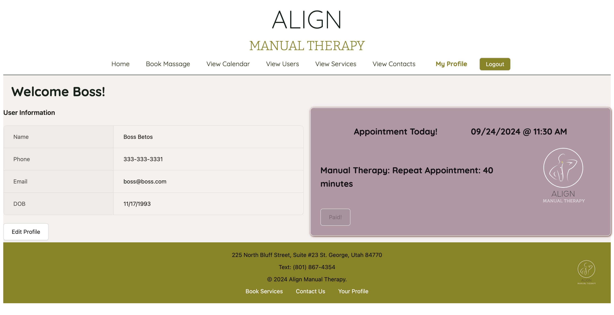
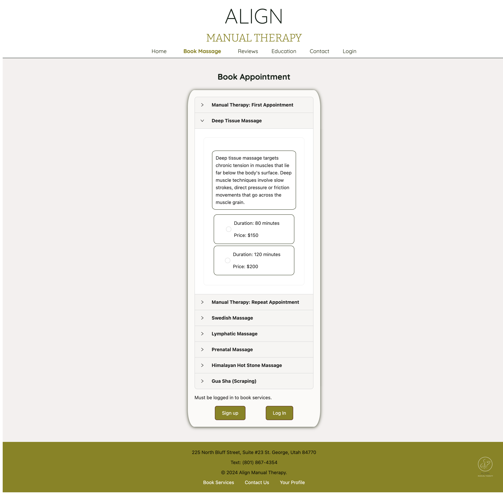
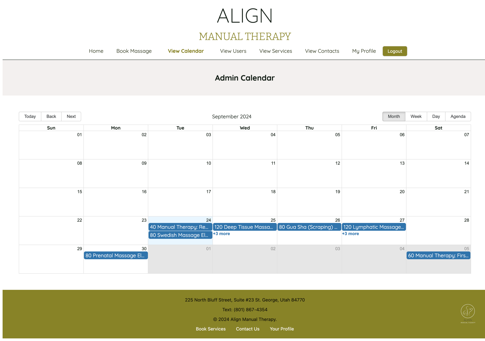

# Align-Manual-Therapy

## Description
Discover Align Manual Therapy with Ryan Osguthorpe, LMT in St.George, Utah.  Experience personalized massage services designed to relieve tension and promote wellness. Book your appointment today for a revitalizing experience!

Align Manual Therapy is a professional massage therapy service offering a variety of treatments to help clients Align their mind and body to achieve a higher quality of life. Using the MERN-stack to create a single-page application, Align Manual Therapy is designed to streamline the process of booking a session, managing appointments and payments, and providing key information for clients, along with admin capabilities to keep track of clients, appointments, services, and payments.

## Table of Contents
* [Usage](#usage)
* [Technologies Used](#technologies-used)
* [Credits](#credits)
* [Questions](#questions)
* [License](#license)

## Usage
Navigate to the link below to access the application. 

### User Services
    Browse services, make an account, book and view appointments, and make payments easily through the user-friendly interface. 
    
    The user must first make an account if they do not have one, and then must be logged in to book appointments and make payments.

    The homepage provides Align Manual Therapy's mission statement and a bit about what osteopathic manual therapy can help with. 

    On the bookings page are the provided services, a description, and the duration and price. From there the user can pick which service they'd like and then select a date from the calendar and see the available appointment times for that day. Once a time is selected the user can confirm and the appointment is booked.

    A completed booking will take the user to their profile that shows their information and their appointments, color coded for ease of viewing. The green cards show future appointments, the purple show appointments for the current day, and the gray cards show past appointments. Appointments can also be paid for here and user information can be edited as well. The user can click on the respective button to pay or edit profile.

    On the reviews page the user can easily check out the amazing, 5 star Google reviews by clicking the button.

    The education page shows the user Ryan's education qualifications and a current photo.

    On the contact page the user can fill out a contact form that will be sent directly to Align Manual Therapy. There is also more contact information and an interactive map for the user to view.

### Admin Services
    On the admin side of Align Manual Therapy, the admin can view their calendar to see upcoming appointments, view the appointment details in full, and an option to run a payment for the appointment.

    The admin can view the users and see their information, edit their information, add a note, or even delete the account. The admin can also upgrade a regular user to admin status.

    The admin can view their services and edit title, description, duration, and price for each service.

    The admin can view the contact forms submitted by the client-side contact form page. These give the admin a quick message or question from the user and an email address that admin can contact the user by.

### [Deployed Application on Railway/Render]()

 

 

 

 

## Technologies Used
    - MongoDB/Mongoose ODM
    - Express.js
    - React
    - Node.js
    - GraphQL/Apollo Server/Apollo Client
    - Ant Design- component library
    - Square- payment processing
    - bcrypt- password hashing
    - JWT(JSON Web Token)- authentication/authorization
    - Leaflet- satellite map
    - dayjs- date/time formatting
    - React calendar/big-calendar/datepicker- calendars/date/time

## Credits
This application was made possible by:
- #### Lindsay 

- #### Ryan

- #### Peyton

- #### Elena

Images by:

- Dzenina Lukac: https://www.pexels.com/photo/landscape-photography-of-green-leaf-trees-330208/

- <a href="https://pixabay.com/users/lizziet5-2690626/?utm_source=link-attribution&utm_medium=referral&utm_campaign=image&utm_content=5712344">Liz Toms</a> from <a href="https://pixabay.com//?utm_source=link-attribution&utm_medium=referral&utm_campaign=image&utm_content=5712344">Pixabay</a>

- Tom Fisk: https://www.pexels.com/photo/aerial-photography-of-green-leafed-trees-2739666/

## Questions 
Contact us with any questions regarding this project.

| Developer | GitHub                                                      | Email                      |
|-----------|-------------------------------------------------------------|----------------------------|
| Lindsay   | [Lindsay Terry](https://github.com/lindsay-terry)           | lindsaytee66@gmail.com     |
| Ryan      | [Ryan Osguthorpe](https://github.com/rhinosstuff)           | rhinosstuff@gmail.com      |
| Peyton    | [Peyton Iverson](https://github.com/AceSpadee)              | ptniversn@gmail.com        |
| Elena     | [Elena Papanikolas](https://github.com/ElenaPapanikolas)    | epapanikolas@hotmail.com   |

## License 
This project is operating under the MIT license. For more detailed information about the license, please click [here](https://opensource.org/licenses/MIT).